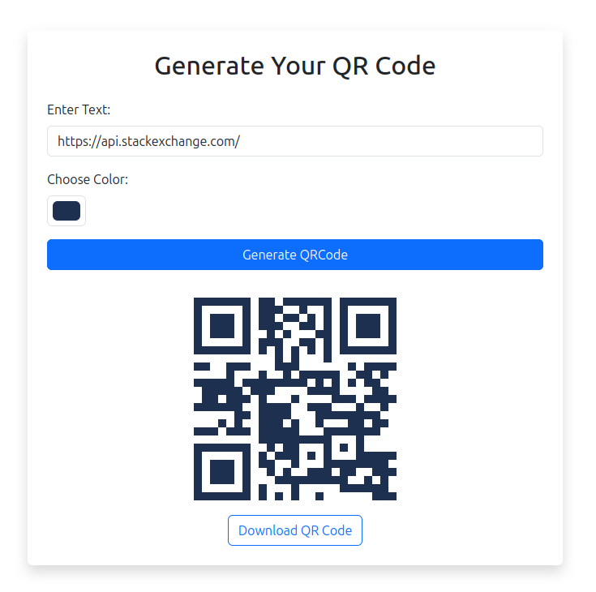

# QR Code Generator using FastAPI and Vue.js

This project is a simple QR code generator built with FastAPI for the backend and Vue.js for the frontend, running in Docker containers.

## Screenshot



## Overview

The application allows users to input text and generates a corresponding QR code image based on the provided text. The backend is built using FastAPI, which dynamically generates QR codes based on user requests. The frontend, powered by Vue.js, provides a user-friendly interface to input text and display the generated QR code.

## Installation and Usage with Docker

To run the project locally using Docker, follow these steps:

### Prerequisites

- [Docker](https://docs.docker.com/get-docker/)
- [Docker Compose](https://docs.docker.com/compose/install/)

### Running the Application

1. Clone this repository.

2. Navigate to the project root directory.

3. Build and start the Docker containers using Docker Compose:

   ```bash
   docker-compose up --build
